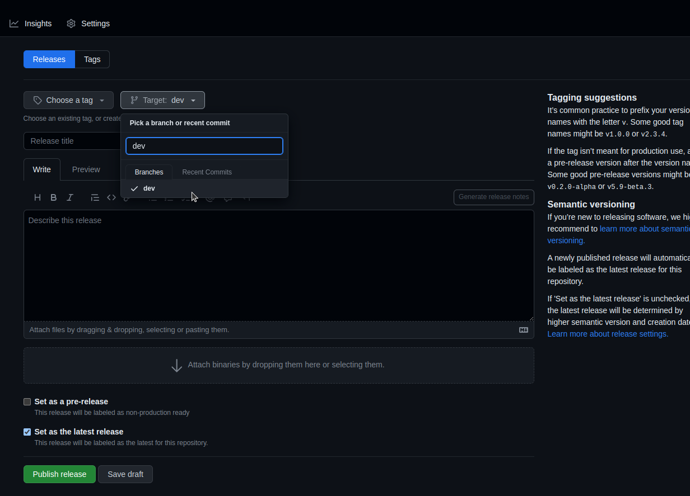
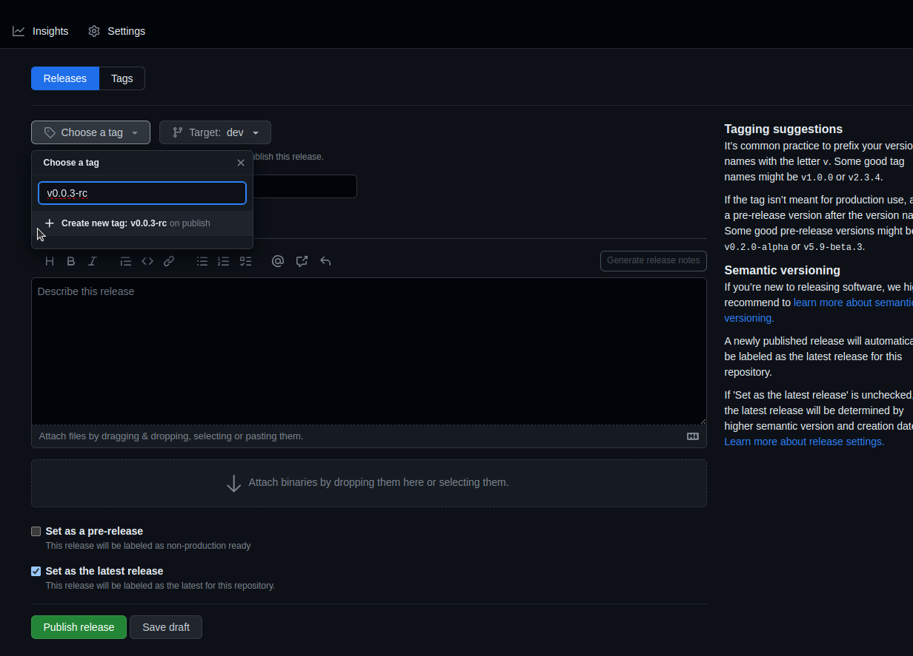
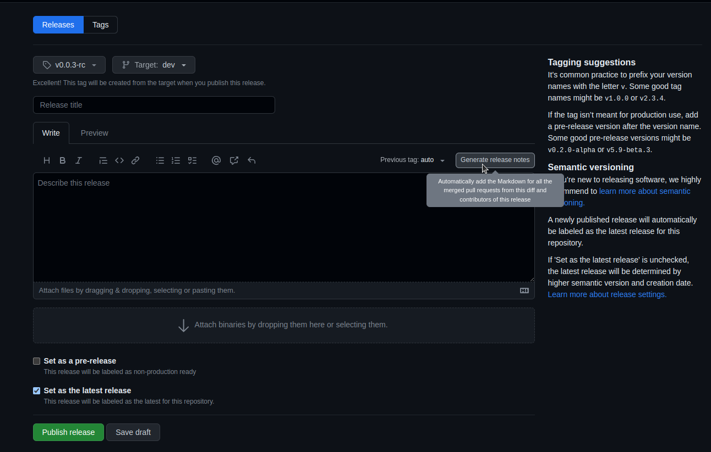
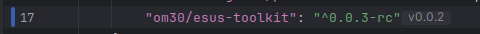
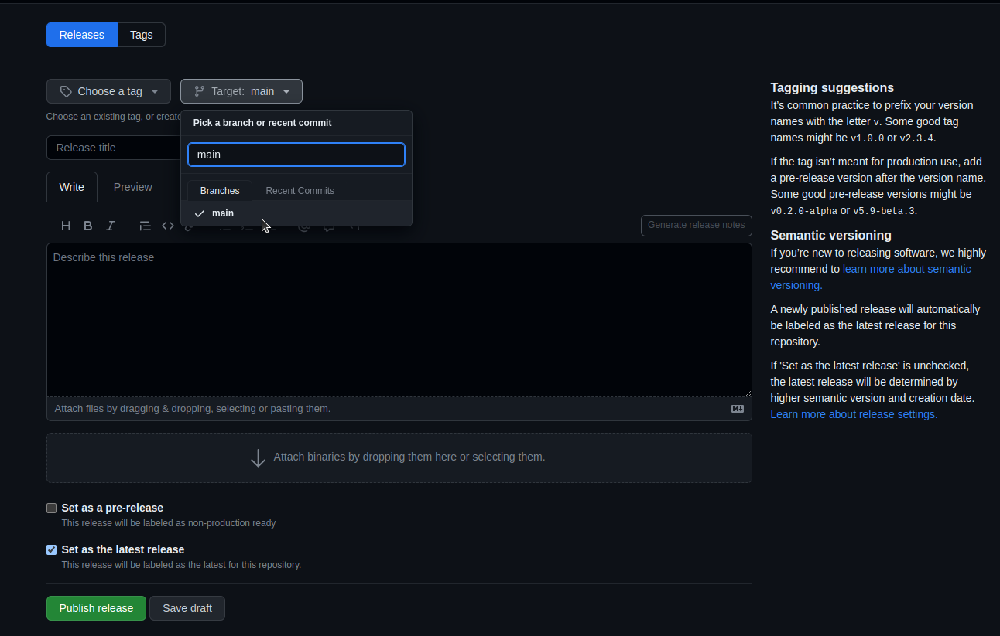
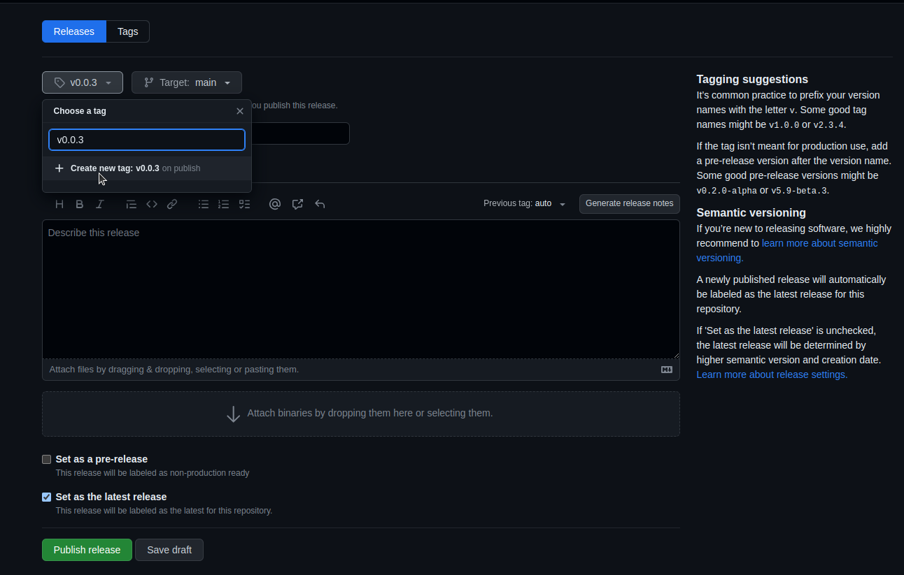
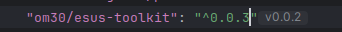

# e-sus-toolkit
Biblioteca contendo as principais ferramentas e classes utilizadas nos projetos e-sus.

### **Procedimentos para gerar release**

*_OBS: este procedimento está sendo feito de forma manual, pois ainda não possuímos os recursos necessários para realizar de uma forma mais automatizada, em breve teremos._ 


Após os PRs serem aprovados e feito o merge na branch dev, seguir no link https://github.com/luizarandaom30/e-sus-toolkit/releases/new
para a geração de uma nova release.

Deve ser selecionado em target a branch **dev**.



Em seguida crie uma nova tag com o número da próxima versão,
primeiro vamos criar a versão release candidate(rc), ex: v0.0.3-rc.



Logo em seguida, clique no botão **Generate release notes** para gerar o changelog, o github ira fazer esse processo conforme os 
últimos PRs aprovados e concluídos.



Gerado o release notes, clique em **Publish Release**. Isso ira gerar uma versão candidata.

Faça os testes necessários, utilize no composer o número da versão candidate para os testes. Rode o comando ``composer update om30/esus-toolkit`` para atualizar a lib



Após validados, vamos gerar a versão final.

Agora vamos executar os seguintes comandos para atualizarmos a branch main com a última release candidate gerada.
Para isso, entre na pasta do projeto e rode os comandos:
```sh 
git fetch --all
git checkout main
git rebase ULTIMA-BRANCH-RC #deve ser colocado o número da última release RC, ex: git rebase v0.0.3-rc
git push origin main -f
```
Entre novamente no link https://github.com/luizarandaom30/e-sus-toolkit/releases/new e em target, selecione a branch **main**.



Cire uma nova tag contendo o número da versão, sem o indicativo de RC, ex: v0.0.3.



Logo em seguida, clique no botão para gerar o changelog. 


Gerado o release notes, basta clica em Publish Release. Isso irá gerar a versão final.
Com a versão final publicada, basta apontá-la no arquivo composer.json do projeto que queira utilizar e rodar o comando
``composer update om30/esus-toolkit`` para atualizar a lib no projeto.

